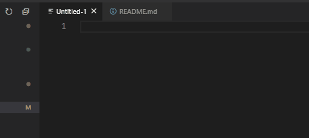
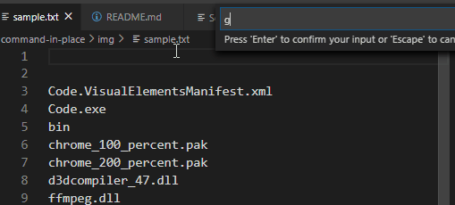
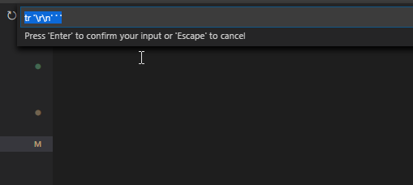
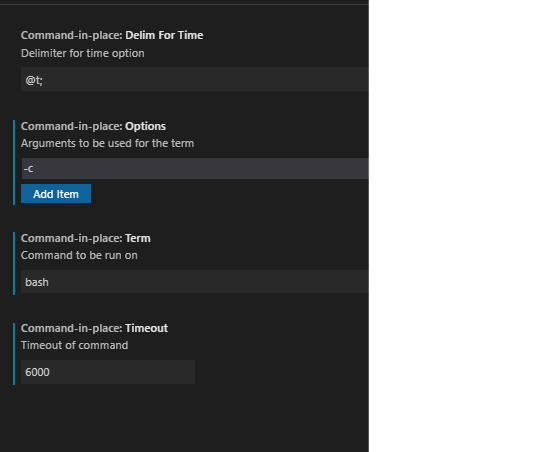

# command-in-place

First VSCode extension created. For fun, not published to MarketPlace.
Inspired by: https://github.com/ryu1kn/vscode-edit-with-shell/

## Features

1. Run command and print to the current file. 
    
    

2. Run command with the current file (using keyword "%fn%").

    

3. Last command is preserved.

    

4. Configurable terminal (i.e. add optiones and switch terminal)

    
